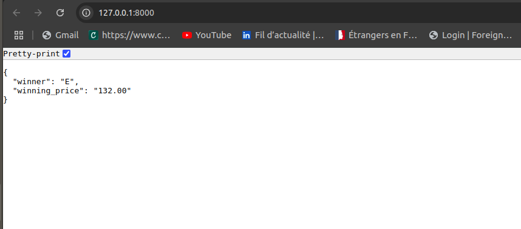

## Vickrey Auction Project

### Description
Ce projet est une implémentation d'un système d'enchères basé sur le principe des enchères de second prix (Vickrey Auction). Les utilisateurs peuvent soumettre leurs enchères, et le système attribue automatiquement l'objet au plus offrant, mais au prix du deuxième enchérisseur le plus élevé.

---

### Fonctionnalités
- Soumission des enchères par les utilisateurs.
- Gestion des enchères et calcul du prix de vente automatiquement.
- Interface utilisateur simple pour interagir avec le système d'enchères.

---

### Prérequis
- Python 3.8 ou supérieur.
- Django 4.2 ou une version compatible.
- Un environnement virtuel pour isoler les dépendances.

---

### Installation

1. **Cloner le projet :**
   ```bash
   git clone https://github.com/votre-repository/vickrey-auction.git
   cd vickrey-auction
   ```

2. **Créer un environnement virtuel :**
   ```bash
   python3 -m venv venv
   source venv/bin/activate  # Sous Windows : venv\Scripts\activate
   ```

3. **Installer les dépendances :**
   ```bash
   pip install -r requirements.txt
   ```

4. **Configurer la base de données :**
   Appliquer les migrations pour initialiser la base de données.
   ```bash
   python manage.py migrate
   ```

5. **Lancer le serveur de développement :**
   ```bash
   python manage.py runserver
   ```

6. **Accéder à l'application :**
   Rendez-vous sur [http://127.0.0.1:8000/](http://127.0.0.1:8000/) pour commencer.

---

### Scripts Importants
- **Ajouter des données de test :**
  Un script Python est inclus pour ajouter des données d'enchères d'exemple :
  ```bash
  python manage.py runscript add_sample_bids
  ```

---

### Technologies utilisées
- **Backend :** Django
- **Base de données :** SQLite
- **Extensions Django :** Django Extensions (scripts, outils pour le développement)

---

### Structure du projet

```plaintext
auction_project/
├── auction/                  # Application principale
│   ├── models.py             # Modèles des enchères
│   ├── views.py              # Logique métier et vue
│   ├── urls.py               # Routes de l'application
│   ├── templates/            # Fichiers HTML
│   └── scripts/              # Scripts utilitaires
├── auction_project/
│   ├── settings.py           # Paramètres globaux
│   ├── urls.py               # Routes principales
│   └── wsgi.py               # Point d'entrée pour le déploiement
├── manage.py                 # Outil CLI pour Django
└── requirements.txt          # Dépendances
```

---

### Auteur
- WANNASI MALIKA


---


